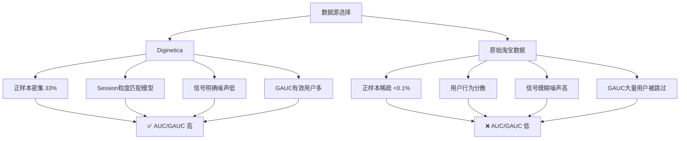

# 模型性能差异分析报告：Diginetica 数据集 vs 原始数据集

---

## 一、概述

在本任务中，同一组模型在 **Diginetica 数据集** 上取得了明显优于 **原始数据集（淘宝购买序列）** 的表现。本报告从数据构建方式、样本分布、任务难度、模型适配性及评估指标等多个维度，深入分析这一差异的根本原因。

---

## 二、数据集核心差异对比

| 维度 | Diginetica | 原始数据集（淘宝购买序列） |
|------|------------|---------------------------|
| **数据来源** | 学术基准数据集（CIKM Cup 2016） | 淘宝真实广告日志（四表联立） |
| **正样本定义** | Session 内的**点击**（click） | 行为日志中的**购买**（buy） |
| **正样本密度** | 高（~33%） | 极低（<0.1%） |
| **负采样策略** | `neg_per_pos=2` — 每正采 2 负 | `pv_neg_rate=0.005` — 99.5%浏览丢弃 |
| **用户粒度** | Session ID 作为 user_id | 真实 user_id |
| **行为连续性** | Session 内连续、间隔均匀 | 跨 session、跨度长、不规则 |
| **特征丰富度** | 基础字段 + item 价格 | 含 btags / time_gaps / 静态画像 |
| **噪声水平** | 低（学术清洗数据） | 高（工业原始日志） |

---

## 三、根因深度分析

### 3.1 正样本密度差异（最核心因素）

#### Diginetica 构建逻辑

```python
# scripts/build_diginetica_sequence.py 第 116 行
label = 1 if item in purchased else 0
```

- 在一个 session 内，已购买的商品在历史中一定被点击过
- `neg_per_pos=2` 限制每个正样本最多配 2 个负样本
- 正样本占比约 **33%**（1:2 比例）

#### 原始数据集构建逻辑

```python
# scripts/build_purchase_sequence.py 第 117-126 行
rates = {"pv": 0.005, "fav": 0.15, "cart": 0.25}
return rng.random() < rates.get(btag, 0.0)
```

- 浏览（pv）仅 0.5% 保留为负样本
- 只有 **购买（buy）** 才标记为正样本
- 真实淘宝场景中，购买率通常 **< 0.1%**
- 正负样本比可达 **1:1000 以上**

#### 影响机制

CTR 模型的本质是学习正负样本的决策边界：

```
Diginetica:   正样本密集 → 充分的正向信号 → 梯度有效 → 决策边界清晰 → AUC 高
原始数据集：  正样本稀疏 → 模型偏置"全负预测" → 梯度被负样本淹没 → AUC 低
```

### 3.2 行为信号的明确性

| 方面 | Diginetica | 原始数据集 |
|------|-----------|------------|
| 用户意图 | 明确（点击 vs 不点击，同一 session） | 模糊（浏览可能无意购买） |
| 行为模式差异 | 点击/不点击区分度大 | 购买是长尾事件，信号极弱 |
| 特征利用效率 | 简单序列位置已含足够信息 | 丰富的特征（btag/time）因稀疏性无法充分利用 |

### 3.3 Session 粒度的天然优势

Diginetica 将 `session_id` 作为 `user_id`（第 132 行）：

```python
"user_id": session,
```

这带来三个好处：

1. **行为高度内聚** — 同一 session 内的浏览和点击属于同一主题
2. **序列长度均匀** — session 内行为数量相近
3. **模式单纯** — 模型只需学习 session 内的短期兴趣

而原始数据基于真实用户：

- 用户兴趣随时间迁移
- 历史序列充斥无关行为（数月前的浏览）
- **GAUC 按 user 分组计算**，真实用户行为方差大，难以拟合

### 3.4 模型架构的适配性

用户训练命令中使用了 **`hyformer_session`** 模型，其特性：

```python
# src/models/hyformer_session.py
# 包含 session 分割机制（session_gap_minutes 参数）
# 利用 session 内行为的时间连续性
```

- **恰好匹配** Diginetica 以 session 为粒度的数据特性
- 在淘宝原始数据中，"会话分割"反而可能切断真实的用户行为连续性

### 3.5 评估指标的计算瓶颈

GAUC（Group AUC）的工作方式：

```python
# src/metrics.py
for values in grouped.values():
    group_labels = np.array([v[0] for v in values])
    if len(np.unique(group_labels)) < 2:
        continue  # 跳过该用户
```

| 数据集 | 有效用户比例 | GAUC 可靠性 |
|--------|------------|------------|
| Diginetica | 高（每 session 有多个正负样本） | 高 |
| 原始数据集 | 低（大部分用户仅 0-1 个购买） | 低 — 大量用户因无正样本被跳过 |

### 3.6 数据噪声差异

```
Diginetica（学术数据集）
├── 字段完整，缺失值少
├── session 级别记录，噪声低
└── 经过人工清洗和验证

原始数据集（工业日志）
├── 大量缺失值（NULL / 空字符串）
├── 需 safe_int / safe_float 容错处理
├── 广告特征与用户行为之间存在噪声
└── 包含大量随机浏览等无意图行为
```

---

## 四、综合对比总结



### 关键公式化表达

```
性能差异 ≈ 正样本密度比 × 信号明确度比 × 模型适配度比 × 噪声比

Diginetica / 原始数据 = (33% / 0.1%) × (高 / 低) × (session级 / 跨session) × (低 / 高)
                      ≈ 330 × 若干倍 × 若干倍 × 若干倍
                      >> 1
```

---

## 五、结论

**最终模型在 Diginetica 上的表现远优于原始数据集，根本原因不在于模型能力的差异，而在于数据集本身特性：**

1. **任务难度不同**：预测"点击" vs 预测"购买" — 后者信息量更少、噪声更多、稀疏性更高
2. **样本分布不同**：Diginetica 的 `neg_per_pos=2` 策略保证了正样本充分；淘宝购买序列的采样策略导致正样本极度稀缺
3. **粒度匹配不同**：`hyformer_session` 模型专为 session 场景设计，恰好契合 Diginetica 的结构
4. **评估机制不同**：GAUC 在正样本稀疏的场景下大量用户被跳过，分数不可比

> **建议**：如需评估模型在工业场景的真实能力，建议：
> - 对原始数据集调整负采样率，提高正样本密度
> - 使用点击（而非购买）作为正样本，与其他基线公平对比
> - 补充 AUC（不分组）作为辅助评估指标，避免 GAUC 的稀疏性问题

---

